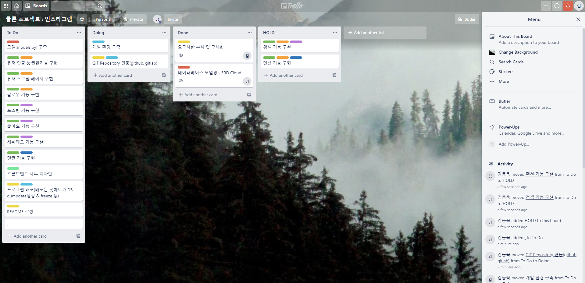
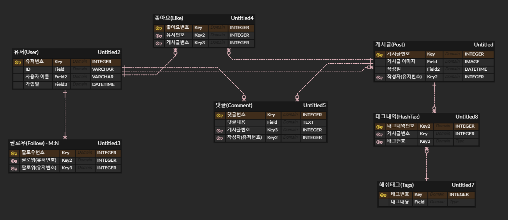

# Clone-Project - Instagram*

## 1. 프로젝트 설명

> 2020.09.30~ 추석 연휴간, 그동안 학습한 Django 기능을 활용하여 인스타그램 웹사이트를 클론코딩 프로젝트를 진행

- Project 참여자 : `김동욱(Donguk Kim)` 

## 2. Instagram 기능 설명

---

#### [유저관련 기능]

---

1. 기본 인증 & 권한 기능 (로그인, 회원가입, 로그아웃, 회원탈퇴, 회원정보 수정 등)
2. 프로필 페이지
   - User 프로필 이미지
   - 자기소개
3. 팔로우

---

#### [포스팅 기능]

---

1. 이미지 업로드 (meadia)
2. 작성자
3. 좋아요 (M:N)
4. 해쉬태그(Hashtag) = 글내용 대체 (M:N)

---

#### [댓글 기능]

----

1. 댓글 작성
2. @멘션 기능 => Optional

---

#### [검색 기능]

---

1. 포스팅 검색 기능
2. 유저 검색 기능
3. 해쉬태그 검색 기능

## 3. 구현 과정 및 결과

---

#### [개발 과정]

---

- `Trello`의 칸반보드를 활용한 개발 Sprint 내용 수시 확인 및 점검 : https://trello.com/

---

#### [데이터베이스 모델링]

---

- DB 모델링에 사용한 Tool : `erdcloud` (https://www.erdcloud.com/)

## 4. 새로 배운 것 & 어려웠던 점

