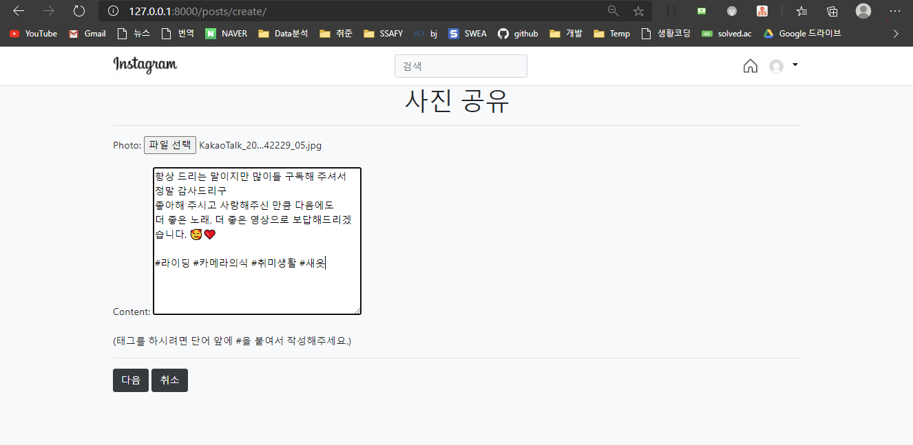

# Clone-Project - Instagram*


## 1. 프로젝트 설명

> 2020.09.30~ 추석 연휴간, 그동안 학습한 Django 기능을 활용하여 인스타그램 웹사이트를 클론코딩 프로젝트를 진행

- Project 참여자 : `김동욱(Donguk Kim)` 


## 2. Instagram 기능 설명

---

#### [유저관련 기능]

---

1. 기본 인증 & 권한 기능 (로그인, 회원가입, 로그아웃, 회원탈퇴, 회원정보 수정 등)
2. 프로필 페이지
   - User 프로필 이미지
   - 자기소개
3. 팔로우


---

#### [포스팅 기능]

---

1. 이미지 업로드 (media)
2. 작성자
3. 좋아요 (M:N)
4. 해쉬태그(Hashtag) = 글내용 대체 (M:N)


---

#### [댓글 기능]

----

1. 댓글 작성
2. @멘션 기능 => Optional


---

#### [검색 기능]

---

1. 포스팅 검색 기능
2. 유저 검색 기능
3. 해쉬태그 검색 기능


## 3. 개발 과정

---

#### [개발 계획]

---


- `Trello`의 칸반보드를 활용한 개발 Sprint 내용 수시 확인 및 점검 : https://trello.com/


---

#### [데이터베이스 모델링]

---


- DB 모델링에 사용한 Tool : `erdcloud` (https://www.erdcloud.com/)


## 4. 구현 결과사진

---

#### [유저관련 기능]

---

1. 기본 인증 & 권한 기능 (로그인, 회원가입, 로그아웃, 회원탈퇴, 회원정보 수정 등)

   > 기본적으로 내비게이션 바에 기능을 구축해놓았으며, 프로필 페이지에서도 편집이 가능하다.

   - 회원가입 페이지

     

     

   - 내비게이션 바의 회원정보 수정 & 프로필 이동 & 로그아웃 기능

     

     

   

2. 프로필 페이지

   > User 프로필 이미지 & 자기소개 & 팔로우 기능

   

   

   


---

#### [포스팅 기능]

---

0. 메인 화면

   

   


1. 이미지 업로드 (media)

   

   

2. 게시물 세부 페이지

   


3. 댓글 기능
   - 


3. 게시글 수정 및 삭제 기능
   - 


---

#### [댓글 기능]

----

1. 댓글 작성
2. @멘션 기능 => Optional


---

#### [검색 기능]

---

1. 검색 기능

   - 해쉬태그(#word)를 검색하여 관련 포스팅 모아보기

     > 내비게이션 바의 검색창에 # + 단어를 검색하면 해쉬태그 검색이 가능하며 관련 포스팅 목록을 펼쳐본다.

      

     

   - 유저 검색

     > 내비게이션 바의 검색창에 #을 붙이지 않고 검색하면 유저 검색이 가능하며, 해당 유저의 프로필 페이지로 이동한다.

     

     

   - 검색 실패 페이지

     


## 6. 개선 및 추가개발 예정 기능

---

#### [하나의 게시글에 여러 이미지를 업로드하는 기능]

---

- 모델링 수정
  - 이미지 클래스를 하나 생성하고, 포스트(게시글) 클래스와 1:N 관계를 형성하는 것으로 계획중.


---

#### [Front-end 개선]

---

- 아직 기본적인 Bootstrap 기능들만 사용하느라 프론트에서 미숙한 부분이 많다. 특히 sizing 처리에서 어려움을 겪고 있으므로 조금 더 공부해서 개선할 계획.

- 인스타그램의 Clone으로 시작했으나 점차 디자인하고 바꿔나갈 계획.


---

#### [Direct Message 기능]

---


## 7. 새로 배운 것 & 어려웠던 점

- front

  ```
  Grid system 어렵
  ```

  ```
  Hover (마우스 오버 효과)
  
  Transition
  ```

```
Django에서 static file (css,img 사용하기)

django는 모듈화가 잘된건지. 웹개발에 최적화 된건지
여하간, tomcat처럼 디렉토리에 이미지나 CSS를 넣는다고 찾아지지 않는다.

(html) templates 처럼 특정 디렉토리를 생성하고 setting.py 파일에 지정해줘야 한다
setting.py에서
STATIC_URL = '/static/' 해주고

각 app 디렉토리 밑에 /static이란 디렉토리를 만들어준다.
사용할 때는 load staticfiles를 불러준후에 경로를 다음과 같이 지정해주면 된다.



출처: https://bcho.tistory.com/821 [조대협의 블로그]
```


- modeling

```
imageField 어렵
```


```
Hashtag 개어렵,...
모델링은 일단 M:N 했는데
구현이 어렵다 흐윽
```


```
처음에 설계를 제대로 안해놓으니까... a태그에 query string 넣고싶은데 안되나ㅠㅠ

=> 그냥 함수 하나 더 만들었음...!
```


```
유저 profile_image가 저장이 안된다.....흑...왜지..
```

